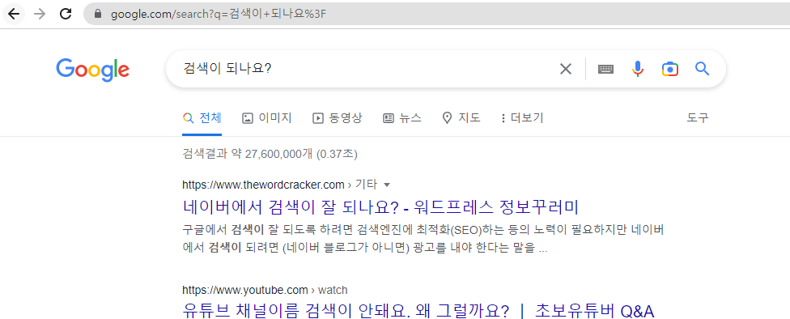

# 간단한 검색창 만들기

- form태그
  action: 연결하고 싶은 url이나 파일
  method: 연결 방법

- form 태그 안의 input태그
  name: 폼의 이름

ex)
검색 버튼을 누르면 구글 검색 결과를 보고 싶다면 검색 url의 ?앞까지의 url을 action에 쓰고, 뒷 부분의 폼이름을 name="폼 이름"을 작성하면 된다.
